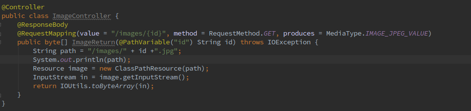

# DistributedFinalProject
分布式期末大作业

#### 建议运行环境
Intellij

#### 当前工作路径
 当前工作路径应该设置为

```
DistributedFinalProject/shiro/samples/spring-boot-web
```
#### 运行
```
mvn tomcat:run
```

### 修改
#### 返回照片 
添加 ImageController.java以及/resources/images文件夹
##### Controller部分
找到上下文，然后返回字节流
默认只接受jpg的格式


#### View 部分
照片直接放在resources/images下面
只能存放.jpg的照片！
请求路径的时候要求使用 /images/xxx.jpg 的类似路径
